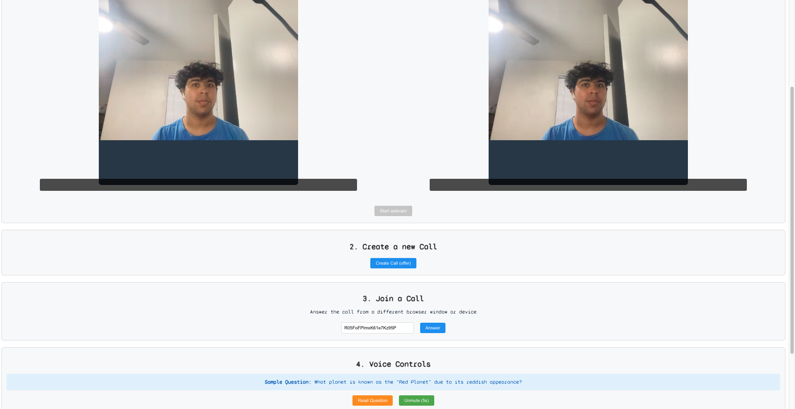

# VideoChat Trivia Game

## Inspiration
The inspiration behind this project comes from my experience on my high school quizbowl team. Before competitions, I often wished for a resource that could help me study and simulate the real quizbowl experience. Quizbowl is a head-to-head general trivia game where the goal is to buzz in first and answer questions correctly to gain points. This project aims to bring that excitement online.

## What It Does
This trivia game enables two players to join a video chat and compete in a quizbowl-style trivia match. The game narrates questions, and players can "buzz in" to answer, creating a real-time competitive experience.

## How We Built It
- **Video Streaming**: Real-time Communication Sessions (RTCSessions) and Firebase were used to enable video streaming between players.
- **Answer Validation**: Gemini AI validates player answers for accuracy.
- **Text-to-Speech**: ElevenLabs provides question narration using text-to-speech.
- **Database**: InterSystems IRIS is used to store and manage the question database.